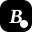

<h1 align="center">
  <br/>
  Blog
</h1>

<div align="center">
  <p>
    <a href="README.md">简体中文</a> | <b>English</b> | <a href="README.ja.md">日本語</a>
  </p>
</div>

<div align="center">
  <h3 align="center">A Modern, Minimalist Digital Garden</h3>
  <p align="center">
    Feel the warmth of life, build a digital garden with code.
  </p>
  
  <p align="center">
    <a href="https://nextjs.org/"></a>
    <a href="https://supabase.com/"></a>
    <a href="https://tailwindcss.com/"></a>
    <a href="https://www.typescriptlang.org/"></a>
    <a href="LICENSE"></a>
    <a href="CONTRIBUTING.md"></a>
  </p>
</div>

---

## 📖 Introduction

This is a modern personal blog system built with **Next.js 16 (App Router)** and **Supabase**.

It is more than just a Content Management System (CMS); it is a digital space focused on reading experience and visual aesthetics. The project combines minimalist design, smooth interactive animations, and powerful writing tools, aiming to provide creators with the purest platform for expression and readers with the most comfortable environment.

## ✨ Features

### 🎨 Ultimate Visual Experience
- **Modern Design**: Built with the shadcn/ui component library, combined with Glassmorphism effects for a clean and transparent interface.
- **Responsive Interactions**: Perfectly adapted for mobile and desktop, including elegant side menus and swipe gestures.
- **Dark Mode**: Flawless system-level dark mode support, easy on the eyes and visually stunning.
- **Typography Aesthetics**: Integrates **Noto Serif SC** to bring print-like reading quality to titles and literary content.
- **Fluid Animations**: Page transitions, splash screens, and micro-interactions powered by Framer Motion.

### ✍️ Powerful Writing System
- **Dual-Mode Editor**: Built on Tiptap, supporting seamless two-way switching between **WYSIWYG** and **Markdown Source**.
- **Smart Assistance**: Supports automatic image upload on paste, drag-and-drop sorting, and intelligent table of contents generation.
- **Content Monetization**: Integrates author profile settings with tipping QR codes (supports WeChat/Alipay).

### 🛡️ Solid Technical Architecture
- **Full-Stack Type Safety**: TypeScript + Supabase generated types, ensuring end-to-end data safety.
- **Enterprise-Grade Authentication**: Complete user authentication flow, supporting avatar uploads (with auto-compression and cleanup) and profile management.
- **High Performance**: Next.js React Server Components (RSC) + Skeleton loading strategies for sub-second responses.
- **SEO Friendly**: Automatically generates Sitemap, Robots config, and JSON-LD structured data for perfect search engine crawling.

## 🛠️ Tech Stack

- **Framework**: [Next.js 16](https://nextjs.org/) (App Router)
- **Language**: TypeScript
- **Styling**: [Tailwind CSS 4](https://tailwindcss.com/)
- **Components**: [shadcn/ui](https://ui.shadcn.com/)
- **Animations**: [Framer Motion](https://www.framer.com/motion/)
- **Database / Auth**: [Supabase](https://supabase.com/) (PostgreSQL)
- **Editor**: [Tiptap](https://tiptap.dev/)

## 🚀 Quick Start

Requirement: Node.js >= 22.0.0.

### 1. Clone the repository

```bash
git clone https://github.com/ZiYan416/Blog
cd blog
```

### 2. Install dependencies

It is recommended to use `npm`:

```bash
npm install
```

### 3. Configure environment variables

Copy `.env.local.example` to `.env.local` and fill in your Supabase configuration:

```bash
cp .env.local.example .env.local
```

### 4. Start the development server

```bash
npm run dev
```

You can now access `http://localhost:3000` to preview the project.

## 🤝 Contributing

We welcome and appreciate all forms of contributions! Whether it's submitting an Issue, adding a new Feature, or improving the documentation, all efforts help make the project better.

Before contributing, please be sure to read our [Contributing Guidelines (CONTRIBUTING.md)](CONTRIBUTING.md) to understand the workflow. If you encounter a Bug or have good suggestions, please refer to the corresponding templates:
- [Bug Report](.github/ISSUE_TEMPLATE/bug_report.md)
- [Feature Request](.github/ISSUE_TEMPLATE/feature_request.md)

## 📄 License

This project is open-sourced under the [MIT License](LICENSE). You are free to study, modify, and use it for any commercial or non-commercial projects.
